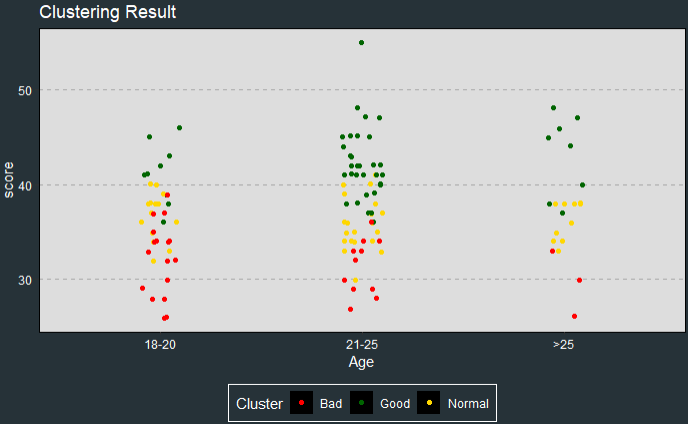
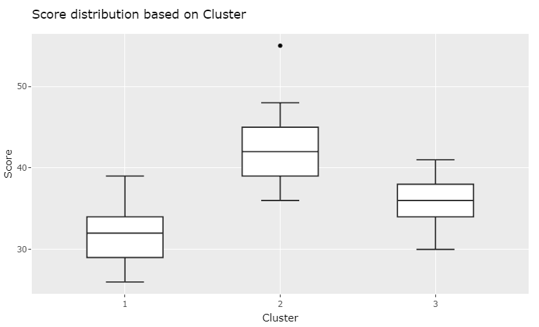

# Time Management Indicator

**Time management indicator** is an app created to help you assess your time management quality, and also give you some recommendation to make it better.
 
 
It already deployed to shiny, just click this link to be the better you:  https://gerald.shinyapps.io/Time-Management-Indicator/

## Table of Contents 
[1. Introduction](#Intro)

[2. Exploratory Data Analysis](#EDA)

[3. Clustering](#Cluster)

[4. Association Rules](#Arules)

[5. About Application](#App)

## Introduction
**Time** is one of the things you cannot buy in life. Everyone has the same amount of time each day, but how we spend our time is up to us. There is a quote that inspires me to make this time management app:
 
> **"Time is what we want the most, but what we use worst."**   - William Penn

The quote speaks for itself, we always say that we need more time to do something or we wish that we can turn back time because we regret not doing something in the past.
 

Because of those reasons, we decided to make this app so you and hopefully all people will be a 'good' time manager for your time. :wink:

## Exploratory Data Analysis

We use the datasets from [Kaggle's Students Time Management Datasets](https://www.kaggle.com/xiaowenlimarketing/international-student-time-management) for this project.

Before we use it to make a model for assess your time management quality and the recommendation, it is very important to take a little look how is the data. Therefore I will start this project with the 'EDA' part.

The author of the dataset create this dataset using a questionnaire,therefore we'll strat the EDA part with the common parameters, which are age and gender.

 From the plot above, we can see that the order of the group of age from many to least are:
 1. The group age of 21-25 years old  
 2. The group age of 18-21 years old 
 3. The group age above 25 years old 
 
 It may be a slightly setbacks because the data did not have a large range of age, so we decided to group it and use that grouping of age to make the model. 
 
 In the matter of gender, it seems the number of female and male respondents are pretty equal. So, if we make the model use this data it is not gender's bias and can be a pretty good model.

 After talking about the gender and age of the respondents, next we'll move into the question's part. We have done some feature engineer to the data and make one additional variable, which is **score**. The questions have a likert scale answers, in the scale of 1-5. We use the scale to make the 'score' variable by adding all the answers, which will get us a maximum score of 60 and minimum score of 12 and here is the distribution:

 

Fortunately, the distribution is quite good, so we can use this data to build the model. :partying_face:
 
It seems the data is normally distributed, but there is an outlier (a score above 50).

For the last EDA part, we will check the boxplot of the score based on age and gender.

Markup :*The plot above looks like that female slightly has a higher score than the male in every group of age,
        *The worst score is in the age of 18-20,
        *The highest score of female is in the group age of 21-25 and male in the group age above 25.

 **For the conclusion of this part we will give you three important points:**
 Markup :*Age and Gender affect time management scores
         *The score distribution is normally distributed
         *There is an equal number of each gender

## Clustering

For the clustering part, to determine the time management quality, we used **K-Prototypes**, a clustering method that can handle mixed types of data. We used these algorithms instead of the famous K-means algorithms because most of our data is not numeric. The algorithms measure the distance between numerical features using Euclidean distance (like K-means) and measure the distance between categorical features using matching categories.

Before we use the K-Prototypes algorithms, we try to determine the number of clusters using the Elbow Method. **Elbow Method** consists of plotting the explained variation as a function of the number of clusters and picking the curve's elbow.

We decide that there is a sharp elbow of the curve is on number 3. Thus, we set the number of clusters into three time management qualities: 

 - Good Time Management Quality
 
 - Normal Time Management Quality
 
 - Bad Time Management Quality

After obtaining the number of clusters, we begin to cluster the data, and this is the result that we get,

From the graph, The majority of the group **Good Time Management Quality** with scores above 40, and it so evident that the higher the scores, the better the time management quality. Unfortunately, we were clustering or grouping the data depending on the scores and the answer to each question for the grouping. That will explain how some data with lower scores get the **Good Time Management Quality** and some data with higher scores get **Bad Time Management Quality** or **Normal Time Management Quality**

If you wonder how we determine the name of the group, we will answer the question now. It is so apparent after seeing the questionnaires and how the score by Likert scale that the higher your scores, the higher your time management quality. Because of that, we made a boxplot of scores based on the group cluster to determine the group name, and we obtained this

We can see above that group number 2 has higher scores than the other two groups, so we decided that group number 2 as a group of **'Good Time Management Quality.'** We can also see that group number 1 has the lowest score among all, so we decided that group number 1 as a group of **'Bad Time Management Quality.'** Last but not least, group number 3 as a group of **'Normal Time Management Quality.'**

## Association Rules 

You must wonder why we use the association rules method into the data. Are there any transactions in this data? doesn't its goal is determining what is the next product that the customer will buy if they already buy one specific item? **Yes, that is true!** We will use that association rules algorithm differently. In this project, association rules determine what aspect leads to a **'Good Time Management Quality'** or **'Bad Time Management Quality.'** If you think it confusing to decide on the transaction data in this dataset, I will tell you it is not, **absolutely not.** We use the row as the transaction or one respondent as one transaction and the twelve questions, gender, and age as the items.

#### Bad Time Management Quality

If you try the survey and fill the question shown above, you will produce a **Bad Time Management Quality**. And the plot below is the interactive visualization that you can try in the shiny app.

#### Good Time Management Quality

If you try the survey and fill the question shown above, you will produce Good Time Management Quality. And the plot below is the interactive visualization that you can try in the app!

I will not explain more about the association rules algorithms because it is beyond the scope of time management topic. If you want to understand how I use the association rules without transaction datasets, you can see here: [Rpubs by me](https://rpubs.com/geraldbryan_/690426). Overall, we use the association rules because we want to show you what action leads to bad or good time management quality. Then, you can eliminate any actions that will lead to bad time management quality and keep doing the activities that will lead to good time management quality.

## About Application

#### Landing Page

Here is the landing page of the **Time Management Indicator** app. On this landing page, you can see an **about** menu in the top right corner, and you can click on it and see the summary, purpose, and sources of this app. Next to it is the **messages** from us to welcome you to the app. There are two buttons on the main page that, if you click them, they will show you what you can expect or what you can do in each menu.

#### Survey

Fill your details in the main page's lift side and then click 'Start Test,' and then it will bring you to the survey part.

After finishing, fill out the twelve questions:

1. Click the OK button.

2. Remember to be honest when you fill it so that you can get your actual result.

3. Don't be hesitate to fill it, because we do not keep your data. After you close the app, the data will be gone.

After finishing fill out the twelve questions click **OK** button. Remember to be honest, so you can get your actual result. Don't be hesitate because we **do not keep your data**, after you close the app the data will be gone.

After you fill it and click the **OK** button, then your result is shown in the plot. Your result will be shown in the shape of a bigger star, and whether you have good, normal, or bad time management quality can be determined by its color.

#### Recommendation

There are three parts to this menu which is **Recommendation, Question List, and Association Rules**. For the recommendation part, we scrap the action that we can do to have a good time management quality. For more details, you can visit this [page](https://quickbooks.intuit.com/r/employee-management/time-management-tips/#:~:text=If%20you%20want%20to%20improve%20your%20time%20management,compare%20actual%20time%20spent%20and%20estimated%20time%20spent.). The **question list** part is the supporting part of **Association Rules**, the association rules only shown like 'X6' or 'X8', so we provide the questions' descriptions behind those variables. We include the association rules in the recommendation because we try to inform you of actions that lead to bad time management quality that you must avoid and actions that lead to good time management quality that you must maintain.

#### Statistics
The statistics menu will explain the dataset itself, which we already present in Exploratory Data Analysis, Clustering, and Association Rules parts, so I will not explain it more to avoid redundancy.

## Enjoy!
I do not want you to take more time to read this, so just head to the shiny app, take the survey, and most important, improve your time management quality no matter what groups you belong to based on our survey.

 
Lastly, I want to provide you with another quote that I like:

> **"The bad news is time flies. The good news is you are the pilot"**   -Michael Altshuler

Thank you for reading and use the app. If you have any feedback, feel free to contact me. Cheers to the better us! :)
