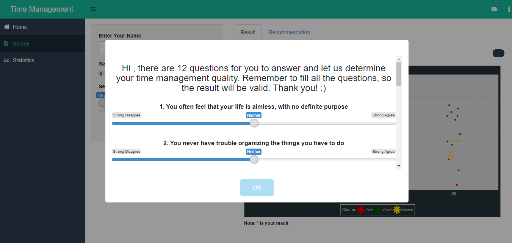

# Time Management Indicator

**Time management indicator** is an app created with R and can help people to make the best of their time. It already deployed on shiny app https://gerald.shinyapps.io/Time-Management-Indicator/, check it out and hope it will help you to improve your time management :)

## Table of Contents 
[1. Introduction](#Intro)

[2. Exploratory Data Analysis](#EDA)

[3. Clustering](#Cluster)

[4. Association Rules](#Arules)

[5. About Application](#App)

### Introduction
**Time** is one of the things you cannot buy in life. Everyone has the same amount of time each day, but how we spend our time is up to us. There is a quote that inspires me to make this time management app:
 
> **"Time is what we want the most, but what we use worst."**   - William Penn

The quote speaks for itself. We always say that we need more time to do something, or we wish that we can turn back time because we regret not doing something in the past. Fortunately, we have a soft skill called **time management**. If we master it, there is a higher chance we can use time more wisely than before.

**Time management** is one of the essential soft skills that everyone must-have. According to the [mindtools team](https://www.mindtools.com/pages/article/newHTE_00.htm), time management is organizing and planning how to divide your time between specific activities. The most important thing that many people misunderstood is **being busy is not the same as being effective**; with good time management skills, we must do the work smarter, not harder.

There is some benefit when we try to learn about time management, such as greater productivity and efficiency, better professional reputation, less stress, increased opportunities for advancement, more excellent opportunities to achieve meaningful life and career goals. Also, there are some things that we can eliminate, such as missed deadlines, inefficient workflow, low work quality, poor professional reputation, and a stalled career.

### Exploratory Data Analysis

The datasets from [Kaggle's Students Time Management Datasets](https://www.kaggle.com/xiaowenlimarketing/international-student-time-management). were collected using a questionnaire with twelve questions are related to time management. Also, there are other variables like age and gender that we used in this project.

The respondents answered the questions by the Likert scale with the range of one to five, where one is the worst and five is the best. At first, we checked the score distribution to make sure it has normal assumptions.

From the result, we can see that the data is normally distributed with an outlier (a score above 50). We can use this dataset for the model to determine time management quality.

After knowing the distribution of scores, now let's see the age and gender statistics.

In the plot above, we can see that the number of males and females is likely to be equal, but there are some significant age differences. The majority of the respondents in the group age of 21-25 and the least respondents are above 25.

Let's see the gender and age of respondents based on the score of their questionnaire,

The plot above looks like that female slightly has a higher score than the male in every group of age. The worst score is in the age of 18-20, and it is evident because generally, teens will tend to spend their time more carelessly.

From the data exploratory of the datasets above, we can conclude that age and gender affect a person's time management score, but it is not an exact condition. There are a lot of factors that can affect time management quality besides ages and genders. If you in the mentioned age and gender group, which tend to get lower time management quality, do not be insecure because it does not define who you are.

### Clustering

For the clustering part, to determine the time management quality, we used **K-Prototypes**, a clustering method that can handle mixed types of data. We used these algorithms instead of the famous K-means algorithms because most of our data is not numeric. The algorithms measure the distance between numerical features using Euclidean distance (like K-means) and measure the distance between categorical features using matching categories.

Before we use the K-Prototypes algorithms, we try to determine the number of clusters using the Elbow Method. **Elbow Method** consists of plotting the explained variation as a function of the number of clusters and picking the curve's elbow.

We decide that there is a sharp elbow of the curve is on number 3. Thus, we set the number of clusters into three time management qualities: 

 - Good Time Management Quality
 
 - Normal Time Management Quality
 
 - Bad Time Management Quality

After obtaining the number of clusters, we begin to cluster the data, and this is the result that we get,

From the graph, The majority of the group **Good Time Management Quality** with scores above 40, and it so evident that the higher the scores, the better the time management quality. Unfortunately, we were clustering or grouping the data depending on the scores and the answer to each question for the grouping. That will explain how there are some data with lower scores get the **Good Time Management Quality** and some data with higher scores get **Bad Time Management Quality** or **Normal Time Management Quality**

If you wonder how we determine the name of the group, we will answer the question now. It is so apparent after seeing the questionnaires and how the score by Likert scale that the higher your scores, the higher your time management quality. Because of that, we made a boxplot of scores based on the group cluster to determine the group name, and we obtained this

We can see above that group number 2 has higher scores than the other two groups, so we decided that group number 2 as a group of **'Good Time Management Quality.'** We can also see that group number 1 has the lowest score among all, so we decided that group number 1 as a group of **'Bad Time Management Quality.'** Last but not least, group number 3 as a group of **'Normal Time Management Quality.'**

### Association Rules 

You must wonder why we use the association rules in this kind of data. Are there any transactions in this data? doesn't it use to determine what product the customer will buy if they already buy one specific item? **Yes, that is true!** We will use that association rules algorithm and use it differently. In this project, we use association rules to determine what aspect leads to a **'Good Time Management Quality'** or **'Bad Time Management Quality.'** If you think it confusing to decide on the transaction data in this dataset, I will tell you it is not, **absolutely not.** We use the row as the transaction or one respondent as one transaction and the 12 questions, gender, and age as the items.

#### Bad Time Management Quality

If you try the survey and fill the question shown above, you will produce a **Bad Time Management Quality**. And the plot below is the interactive visualization that you can try in the shiny apps.

#### Good Time Management Quality

If you try the survey and fill the question shown above, you will produce Good Time Management Quality. And the plot below is the interactive visualization that you can try in the app!

I will not explain more about the association rules algorithms because it will be out of the topic. If you want to understand how I use the association rules without transaction datasets, you can see here:  [Rpubs by me](https://rpubs.com/geraldbryan_/690426). Overall, we use the association rules because we want to show you what action leads to bad or good time management quality. So, all of you can eliminate the step that will lead to bad time management quality and keep doing the activities that will lead to good time management quality.

### About Application

#### Landing Page

Here is the landing page of the **Time Management Indicator** app. On this landing page, you can see an **about** menu in the top right corner, and you can click on it and see the summary, purpose, and sources of this app. Next to it is the **messages** from us to welcome you to the app. There are two buttons on the main page that, if you click, will show you what you can expect or what you can do in each menu.

#### Survey

comment 1 here:
Fill your details in the main page's lift side and then click 'Start Test,' and then it will bring you to the survey part.

After finishing, fill out the 12 questions:

1. Click the OK button.

2. Remember to be honest when you fill it so that you can get your actual result.

3. Don't be hesitate to fill it, because we do not keep your data. After you close the app, the data will be gone.

After finishing fill out the 12 questions click **OK** button. Remember to be honest when you fill it, so you can get your actual result. Don't be hesitate to fill it, because we **do not keep your data**, after you close the app the data will be gone.

After you fill it and click the ok button, then your result is shown in the plot. Your result will be shown in the shape of a bigger star, and whether you have good, normal, or bad time management quality can be determined by the color of the star.

#### Recomendation

There are three parts to this menu which is **Recommendation, Question List, and Association Rules**. For the recommendation part, we scrap the action that we can do to have a good time management quality. For more details, you can visit this [page](https://quickbooks.intuit.com/r/employee-management/time-management-tips/#:~:text=If%20you%20want%20to%20improve%20your%20time%20management,compare%20actual%20time%20spent%20and%20estimated%20time%20spent.). The **question list** list part is the supporting part of **Association Rules**, the association rules only shown like 'X6' or 'X8', so we provide the questions behind those variables. We include the association rules in the recommendation because we try to inform you of actions that lead to bad time management quality that you must avoid and actions that lead to good time management quality that you must maintain.

#### Statistics
The statistics menu will explain the dataset itself, which we already present in Exploratory Data Analysis, Clustering, and Association Rules parts, so I will not explain it more to avoid redundancy.

## Enjoy
I do not want you to take more time to read this, so just head to the shiny app, take the survey, and most important, Improve your time management quality no matter what groups you belong to based on our survey.

 
Lastly, I want to provide you with another quote that I like:

> **"The bad news is time flies. The good news is you are the pilot"**   -Michael Altshuler

Thank you for reading and use the app. If you have any feedback, feel free to contact us. Cheers to the better us! :)
